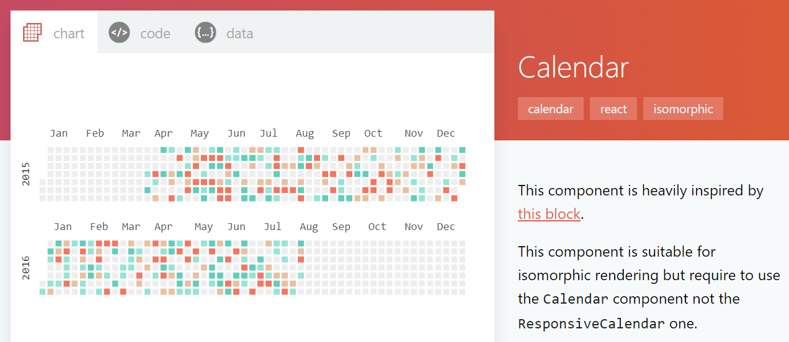
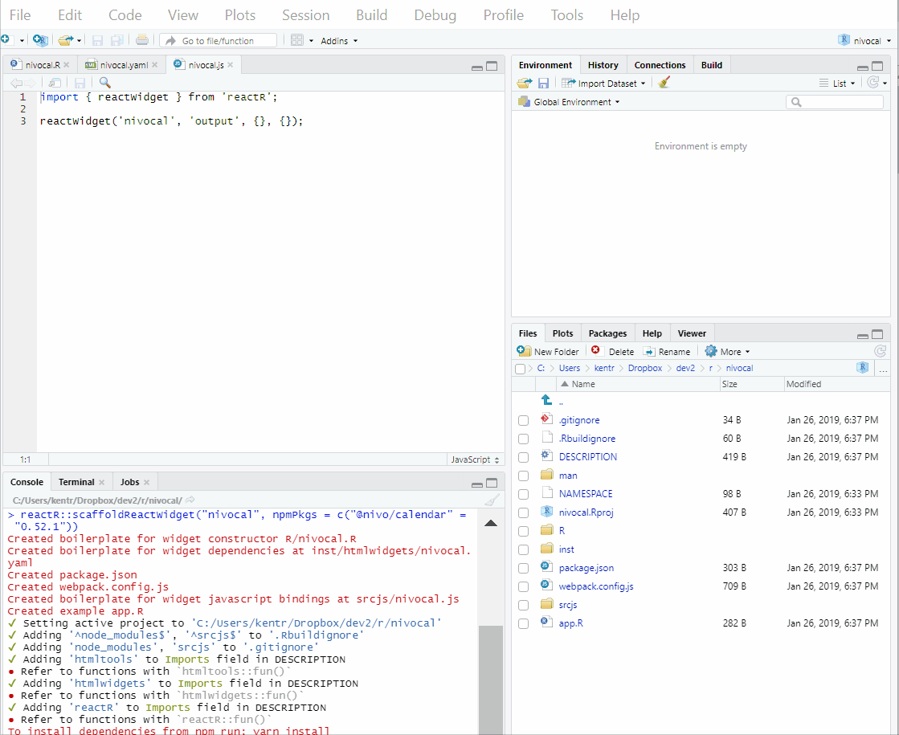
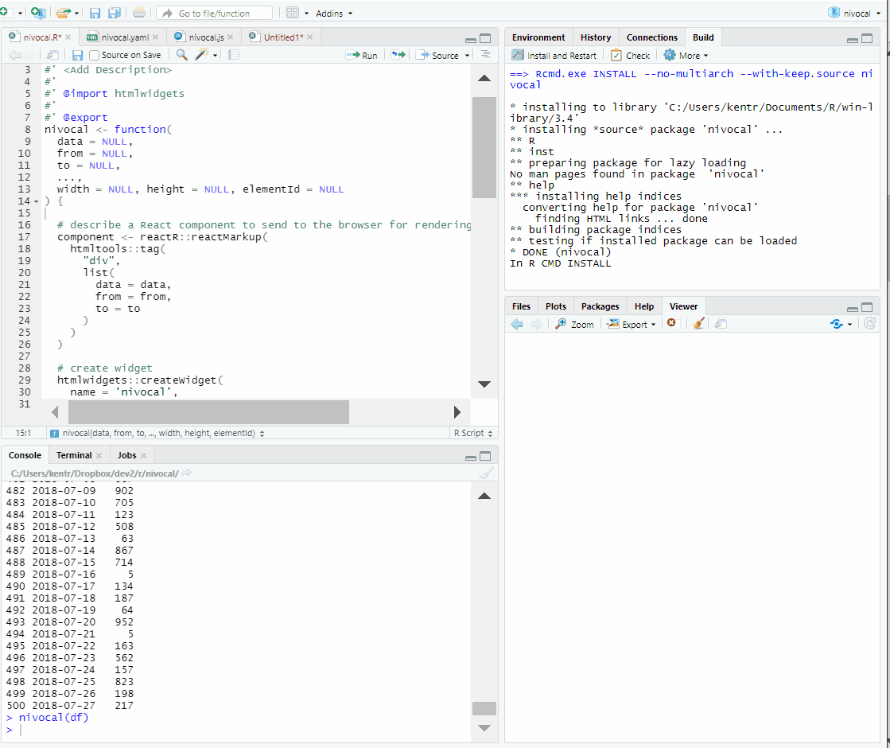
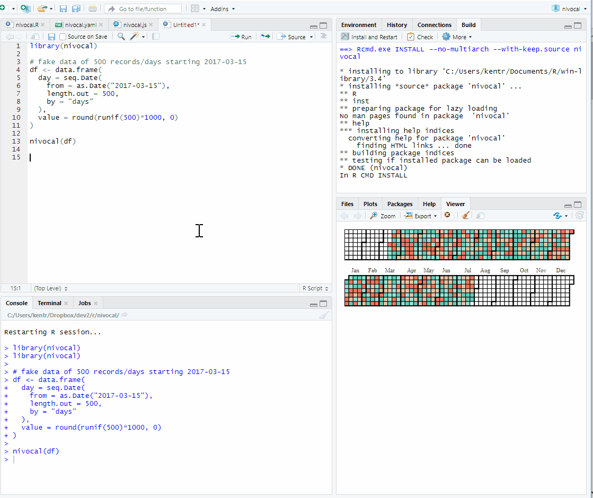

<!-- README.md is generated from README.Rmd. Please edit that file -->

```{r setup, include = FALSE}
knitr::opts_chunk$set(
  collapse = TRUE,
  comment = "#>",
  fig.path = "man/figures/README-",
  out.width = "100%"
)
```
# Making of nivocal

`nivocal` was built to be a working package, but while I was at it I wanted to record each step in the creation journey as a reference for future authors of [`reactR`](https://github.com/react-R/reactR)-based `htmlwidgets`.  For reference, the package in its initial working state required less than 30 minutes of effort.  I never left my RStudio window, and I only had to write 1.5 lines of JavaScript.

## One Time on the Internet I Found ...

There are some amazing [`React`](https://reactjs.org/) comoponents out there.  If one day on the Internet, you find something you like then it can be ready to use in R in less than an hour (hopefully shorter if you read this document).  Take for example the [\@nivo](https://nivo.rocks/components) set of components.  I'd like to use the Github-style [calendar](https://nivo.rocks/calendar/).



## Starting the Package

[`usethis`](https://github.com/r-lib/usethis) allows us to create a package in one line of code.  Let's begin our journey here.

```{r eval=FALSE}
usethis::create_package("nivocal")
```


## Scaffolding

Once we have a package, we'll open it up and then build a scaffold.  Sometimes finding the `npmPkgs` argument can be a little tricky.  Usually, the best clues are in the docs, but we can also use [unpkg.com](https://unpkg.com)--the CRAN of Node JavaScript--for some help.  End the url with `/` to see the contents of the package and find the most recent version.  For the calender, we do [https://unpkg.com/@nivo/calendar/](https://unpkg.com/@nivo/calendar/).  Remember the `/`.  Try [https://unpkg.com/@nivo/calendar](https://unpkg.com/@nivo/calendar) to see the difference.

```{r eval=FALSE}
scaffoldReactWidget(
  "nivocal",
  npmPkgs = c("@nivo/calendar" = "0.52.1")
)
```


Now we have  all the files we need for a working `htmlwidget` but unfortunately not working in the way we want.

## 1.5 Lines of JavaScript

In the JavaScript, we will need to import the module we want to use.  For `nivocal` we want `ResponsiveCalendar`.   `import` in JavaScript is very similar to `library()` in R.

```{r eval=FALSE}
import { ResponsiveCalendar } from '@nivo/calendar'
```


## Build JavaScript

The JavaScript build toolchain can get complicated, but fortunately `reactR` takes care of much of this for us.  I hate to tell you, but you will need to install [`node`](https://nodejs.org/en/download/) and [`yarn`](https://yarnpkg.com/lang/en/docs/install).  I promise this is not hard or scary though.  Once you have both installed, we will build/webpack our JavaScript in the RStudio terminal or other terminal/console.

```{r eval=FALSE}
yarn install
yarn run webpack
```



The built JavaScript will be copied into the `/inst/htmlwidgets` directory ready for use in our R `htmlwidget`.

## Build R Package

We have a couple more things to do on the `R` side.  For now, let's see if the package builds. In RStudio, we can `CTRL + Shift + B` or 

```{r eval=FALSE}
devtools::document()
devtools::install(quick = TRUE)
```


If all goes well, then our package is working, but as I said just not quite in the way we want.

## Add Some Arguments

Now we need a way to go from R to JavaScript.  We'll add arguments for the `data`, `from`, and `to` component `props` in our `R` function.


## Change the Tag

The scaffold uses `div`, but we want to use the `ResponsiveCalendar` component.  `React` components are always [capitalized](https://reactjs.org/docs/jsx-in-depth.html#user-defined-components-must-be-capitalized).




## Add More Props/options and Do Some R Work

There are a lot of other options for the calendar.  For a well-built R package, I think each of these should be dcoumented arguments, but for now we'll use `...` to pass other options from R to JavaScript.

`data`, `from`, and `to` are required for the calendar component.  Eventually, we want to accept various forms of `data` from the user, but for now we will assume the user provides a `data.frame` with two columns `day` and `value`.  `htmlwidgets` communicate `data.frames` as an [array of arrays](https://www.htmlwidgets.org/develop_advanced.html#data-transformation) but `ResponsiveCalendar` wants the equivalent of `dataframe = "rows"` in `jsonlite::toJSON()`.  We'll use `mapply` to do this, but as described in the [data transformation](https://www.htmlwidgets.org/develop_advanced.html#data-transformation) article we have other methods to achieve this.  The most common form -- using JavaScript `HTMLWidgets.dataframeToD3()` -- does not currently work well with `reactR`-based `htmlwidgets`.

Without `from` and `to`, the calendar will not render, so let's assume the user wants `from` to be the first row of the data and `to` to be the last row.


## It's Working

Now we have a working `htmlwidget`.  Build the package with `CTRL+Shift+B` or 

```{r eval=FALSE}
devtools::document()
devtools::install(quick = TRUE)
```

Give it some data and see an interactive calendar.

```{r eval=FALSE}
library(nivocal)

# fake data of 500 records/days starting 2017-03-15
df <- data.frame(
  day = seq.Date(
    from = as.Date("2017-03-15"),
    length.out = 500,
    by = "days"
  ),
  value = round(runif(500)*1000, 0)
)

nivocal(df)
```


## Customize

Remember we added `...` for further customization.  Let's see how this works.

```{r eval=FALSE}
library(nivocal)

# fake data of 500 records/days starting 2017-03-15
df <- data.frame(
  day = seq.Date(
    from = as.Date("2017-03-15"),
    length.out = 500,
    by = "days"
  ),
  value = round(runif(500)*1000, 0)
)

nivocal(
  df,
  direction = "vertical",
  colors = RColorBrewer::brewer.pal(n=9, "Blues")
)
```



## More Resources

Even though all of this is fairly new, we have tried to offer examples and resources to ease the learning curve.  The [react-R Github organization](https://github.com/react-R) is intended to be a friendly central location for all things R + React.  Please join in the fun.

- [Alan Dipert rstudio::conf 2019 Video](https://resources.rstudio.com/rstudio-conf-2019/integrating-react-js-and-shiny) hear from the creator himself

- [Authoring reactR htmlwidgets tutorial](https://react-r.github.io/reactR/articles/intro_htmlwidgets.html)

- [react-sparklines example package](https://github.com/react-R/sparklines-example) great first example package

- [office-fabric-ui example package](https://github.com/react-R/roffice) widget example with no JavaScript build steps

- [MapboxGL example package](https://github.com/react-R/MapboxGL-example) package discussed in the rstudio::conf 2019 video

- [forcer](https://github.com/react-R/forcer) `react-force-graph` example package for `2d`, `3d`, and virtual reality force directed network graphs.


## Vue

We'd like to do the same for `Vue`.  Please let us know if you have interest.  [`vueR`](https://github.com/timelyportfolio/vueR) would be a good starting point.
